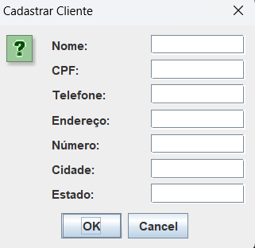
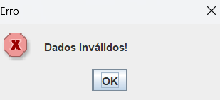
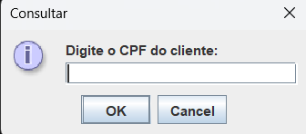
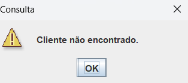
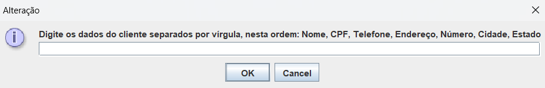
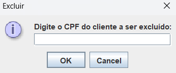
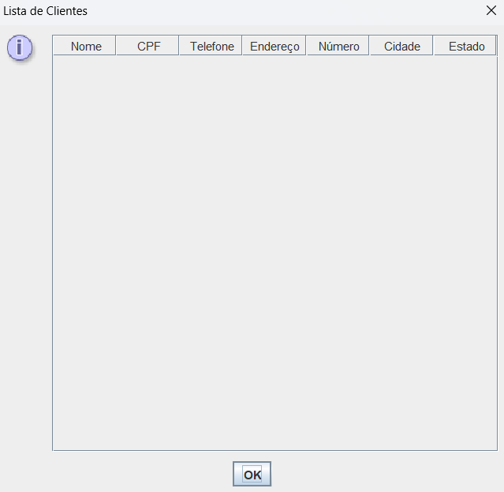
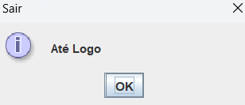

# Sistema de Cadastro de Clientes

## Sumário
- [Descrição](#descrição)
- [Tecnologias Utilizadas](#tecnologias-utilizadas)
- [Uso](#uso)
- [Capturas de Tela](#capturas-de-tela)
- [Ícones das Imagens](#ícones-das-imagens)
- [Melhorias Futuras](#melhorias-futuras)
- [Contato](#contato)

## Descrição

Este projeto é um sistema de cadastro de clientes simples desenvolvido em **Java** e **Swing**. Ele permite adicionar, consultar, alterar, excluir e listar clientes de forma intuitiva através de uma interface gráfica amigável.

## Tecnologias Utilizadas

- **Java**: Linguagem de programação principal.
- **Swing**: Biblioteca para criação da interface gráfica.
- 
## Uso

O sistema oferece seis funcionalidades principais:

- **Cadastrar**: Adicione um novo cliente.
- **Consultar**: Busque um cliente pelo CPF.
- **Alterar**: Modifique os dados de um cliente existente.
- **Excluir**: Remova um cliente do sistema.
- **Listar**: Visualize todos os clientes cadastrados.
- **Sair**: Feche o aplicativo.

## Capturas de Tela

Abaixo estão algumas capturas de tela que ilustram as principais funcionalidades do sistema.

### Cadastro de Cliente

    

        
        
<strong>Cadastro de Cliente</strong>

    

    

        
        
<strong>Cliente Cadastrado</strong>

    

    

        
        
<strong>Erro no Cadastro</strong>

    

### Consulta de Cliente

    

        
        
<strong>Buscar Cliente</strong>

    

    

        
        
<strong>Consulta Não Encontrada</strong>

    

### Alteração de Dados

    

        
        
<strong>Alterar Dados</strong>

    

### Exclusão de Cliente

    

        
        
<strong>Deletar Cliente</strong>

    

    

        
        
<strong>Cliente Deletado</strong>

    

### Listagem de Clientes

    

        
        
<strong>Listar Clientes</strong>

    

### Saída do Sistema

    

        
        
<strong>Sair do Sistema</strong>

    

## Ícones das Imagens

Os ícones de imagens das capturas de tela foram tirados da [FLATICON](https://www.flaticon.com/).

## Melhorias Futuras

- Melhorar a Estética da Interface
- Integrar um banco de dados (como MySQL ou SQLite)

---
*Desenvolvido por [Mateus Garcia](https://github.com/M2004GV)*
