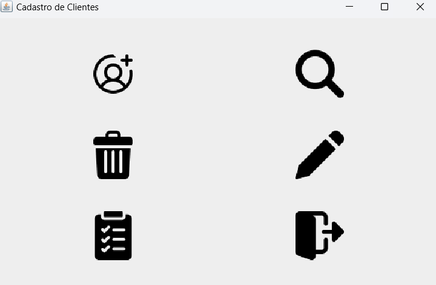

# Sistema de Cadastro de Clientes

## Descrição
Este projeto é um sistema de cadastro de clientes simples desenvolvido em Java e Swing.

## Instalação
1. Clone o repositório: `git clone https://github.com/M2004GV/cadastro_cliente`
2. Certifique de ter baixado as imagens e que os caminhos estejam corretos
3. Certifique que tenham o `JDK` na sua máquina instalado; caso não tenha, instale na [Oracle_Java](https://www.oracle.com/java/technologies/downloads/)
5. Abra o projeto no seu IDE.
6. Execute a classe `App`.

## Uso
Dentre as seis funcionalidades disponíveis, temos:
- Clique em "Cadastrar" para adicionar um novo cliente.
- Clique em "Consultar" para buscar um cliente pelo CPF.
- Clique em "Alterar" para modificar os dados de um cliente.
- Clique em "Excluir" para remover um cliente.
- Clique em "Listar" para ver todos os clientes cadastrados.
- Clique em "Sair" para fechar o aplicativo.

## Capturas de Tela

### Tela Principal

    

*Interface principal do sistema com os botões de ação.*

### Cadastro de Cliente

    

*Formulário para cadastrar um novo cliente.*

### Cliente Cadastrado

    

*Mensagem de sucesso após o cadastro de um cliente.*

### Erro no Cadastro

    

*Mensagem de erro exibida ao tentar cadastrar um cliente com dados inválidos.*

### Buscar Cliente

    

*Tela para buscar um cliente pelo CPF.*

### Consulta Não Encontrada

    

*Mensagem exibida quando a consulta não encontra nenhum cliente.*

### Alterar Dados

    

*Interface para alterar os dados de um cliente existente.*

### Deletar Cliente

    

*Tela para confirmar a exclusão de um cliente.*

### Cliente Deletado

    

*Confirmação de exclusão de um cliente.*

### Listar Clientes

    

*Tabela exibindo a lista de todos os clientes cadastrados.*

### Sair do Sistema

    

*Confirmação de saída do sistema.*

## Ícones das imagens
- Os ícones das imagens da tela principla foram tirados do [FLATICON](https://www.flaticon.com/)

## Melhorias Futuras
- Implementar validação de dados em tempo real.
- Melhorar a estética da interface.
