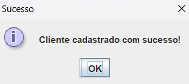

# Sistema de Cadastro de Clientes

## Descrição
Este projeto é um sistema de cadastro de clientes simples desenvolvido em Java e Swing.

## Instalação
1. Clone o repositório: `git clone https://github.com/M2004GV/cadastro_cliente`
2. Certifique de ter baixado as imagens e que os caminhos estejam corretos
3. Abra o projeto no seu IDE.
4. Execute a classe `App`.

## Uso
Dentre as seis funcionalidades disponíveis, temos:
- Clique em "Cadastrar" para adicionar um novo cliente.
- Clique em "Consultar" para buscar um cliente pelo CPF.
- Clique em "Alterar" para modificar os dados de um cliente.
- Clique em "Excluir" para remover um cliente.
- Clique em "Listar" para ver todos os clientes cadastrados.
- Clique em "Sair" para fechar o aplicativo.

## Capturas de Tela

### Tela Principal

### Cadastro de Cliente

### Alterar Dados

### Buscar Cliente

### Cliente Cadastrado

### Consulta Não Encontrada

### Cliente Deletado

### Deletar Cliente

### Erro no Cadastro

### Listar Clientes

### Sair do Sistema

## Ícones das imagens
- Sobre os ícones das imagens, eles foram tirados do [FLATICON](https://www.flaticon.com/)

## Melhorias Futuras
- Implementar validação de dados em tempo real.
- Melhorar a estética da interface.

## Contribuições
Contribuições são bem-vindas! Sinta-se à vontade para abrir issues ou pull requests.
